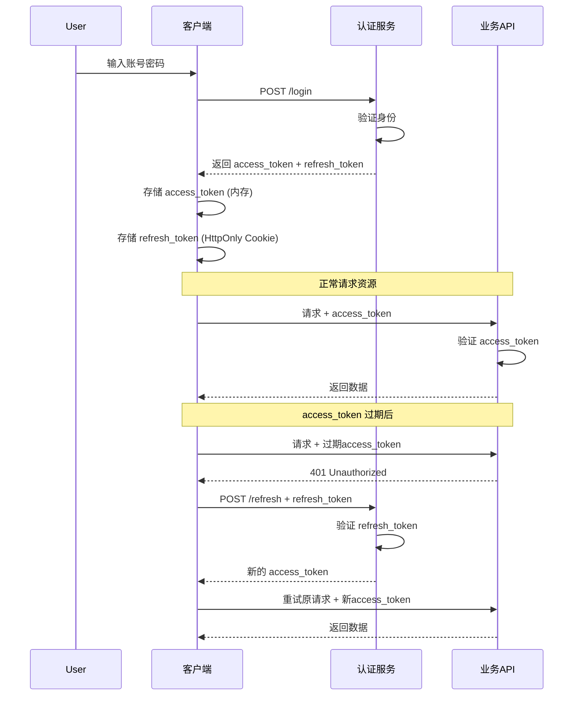

## JWT 访问令牌 + 刷新令牌 完整解析

JWT（JSON Web Token）是现代 Web 应用中常用的身份认证方案。其中 **Access Token（访问令牌）** 和 **Refresh Token（刷新令牌）** 的组合设计，兼顾了安全性与用户体验。

---

### 📌 核心概念

| 令牌类型 | 生命周期 | 存储位置 | 作用 |
| :--- | :--- | :--- | :--- |
| **Access Token** | 短（15分钟 ~ 2小时） | 客户端内存（推荐） | 访问受保护资源（API） |
| **Refresh Token** | 长（数天 ~ 数月） | HttpOnly Cookie 或安全存储 | 获取新的 Access Token |

---

### 🔄 经典工作流程



---

### ✅ 为什么需要 Refresh Token？

| 问题 | 只有 Access Token（长期有效） | Access + Refresh 方案 |
| :--- | :--- | :--- |
| **被盗风险** | 令牌可长期滥用，危害大 | Access 短期有效，减少损失窗口 |
| **注销困难** | 无法主动失效，除非改密码 | Refresh Token 可存入黑名单或撤销 |
| **频繁登录** | 用户每隔几小时就要重新登录 | 用户无感知刷新令牌 |
| **性能开销** | 无额外请求 | 多一次刷新请求，但次数少 |

**总结**：Refresh Token 让 Access Token 保持“短命”以降低风险，同时避免频繁打扰用户登录。

---

### 🛡️ 安全最佳实践

#### 1. **Access Token 存储**
```javascript
// ❌ 不安全：localStorage（易受 XSS 攻击）
localStorage.setItem('access_token', token);

// ✅ 安全：内存（闭包变量或 React state）
let inMemoryToken = null;

// 或使用 sessionStorage（仍有 XSS 风险，但比 localStorage 好一些）
```

#### 2. **Refresh Token 存储**
```javascript
// ✅ 推荐：HttpOnly Cookie（无法被 JS 读取，防 XSS）
document.cookie = "refresh_token=...; HttpOnly; Secure; SameSite=Strict; Path=/refresh";
```

#### 3. **一次一用 & 轮换机制**
为防止 Refresh Token 被劫持后无限使用，可采用**轮换**策略：
- 每次刷新时，除了返回新的 Access Token，也返回**新的 Refresh Token**
- 旧的 Refresh Token 立即失效（存入黑名单或数据库标记）
- 若用一个旧 Refresh Token 多次尝试刷新，说明可能被攻击，应撤销整个家族

```javascript
// 刷新接口伪代码
app.post('/refresh', (req, res) => {
  const oldRefreshToken = req.cookies.refresh_token;
  const payload = verifyRefreshToken(oldRefreshToken);
  if (!payload) return res.status(401).json({ error: 'Invalid refresh token' });

  // 检查黑名单（数据库或 Redis）
  if (isRevoked(oldRefreshToken)) {
    // 可能被盗，撤销该用户所有 token
    revokeAllUserTokens(payload.sub);
    return res.status(401).json({ error: 'Token reused, possible attack' });
  }

  // 生成新的 access + refresh token
  const newAccessToken = generateAccessToken(payload.sub);
  const newRefreshToken = generateRefreshToken(payload.sub);

  // 旧 token 加入黑名单（或删除）
  revokeToken(oldRefreshToken);

  // 设置新 refresh token（HttpOnly Cookie）
  res.cookie('refresh_token', newRefreshToken, { httpOnly: true, secure: true, sameSite: 'strict' });
  res.json({ access_token: newAccessToken });
});
```

#### 4. **合理的过期时间**
| 场景 | Access Token 有效期 | Refresh Token 有效期 |
| :--- | :--- | :--- |
| 普通 Web 应用 | 15 ~ 30 分钟 | 7 天 |
| 移动 App | 4 ~ 24 小时 | 30 天 |
| 极高安全场景（银行） | 5 分钟 | 1 小时（需频繁交互） |

---

### 🧪 前端实现示例（React + Axios 自动刷新）

```javascript
import axios from 'axios';

let isRefreshing = false;
let failedQueue = [];

const processQueue = (error, token = null) => {
  failedQueue.forEach(prom => {
    if (error) prom.reject(error);
    else prom.resolve(token);
  });
  failedQueue = [];
};

axios.interceptors.response.use(
  response => response,
  async error => {
    const originalRequest = error.config;
    if (error.response?.status === 401 && !originalRequest._retry) {
      if (isRefreshing) {
        // 等待刷新完成
        return new Promise((resolve, reject) => {
          failedQueue.push({ resolve, reject });
        }).then(token => {
          originalRequest.headers.Authorization = `Bearer ${token}`;
          return axios(originalRequest);
        }).catch(err => Promise.reject(err));
      }

      originalRequest._retry = true;
      isRefreshing = true;

      try {
        const res = await axios.post('/refresh'); // refresh_token 自动从 cookie 携带
        const newAccessToken = res.data.access_token;
        // 更新内存中的 access token
        setAccessToken(newAccessToken);
        // 重试队列中的请求
        processQueue(null, newAccessToken);
        // 重试当前请求
        originalRequest.headers.Authorization = `Bearer ${newAccessToken}`;
        return axios(originalRequest);
      } catch (refreshError) {
        processQueue(refreshError, null);
        // 跳转到登录页
        window.location.href = '/login';
        return Promise.reject(refreshError);
      } finally {
        isRefreshing = false;
      }
    }
    return Promise.reject(error);
  }
);
```

---

### 🗂️ 后端实现要点（Node.js + JWT）

```javascript
const jwt = require('jsonwebtoken');
const refreshTokenMap = new Map(); // 生产环境改用 Redis 或数据库

// 生成 Access Token（短时效）
function generateAccessToken(userId) {
  return jwt.sign({ sub: userId, type: 'access' }, process.env.ACCESS_SECRET, { expiresIn: '15m' });
}

// 生成 Refresh Token（长时效）
function generateRefreshToken(userId) {
  const refreshToken = jwt.sign({ sub: userId, type: 'refresh' }, process.env.REFRESH_SECRET, { expiresIn: '7d' });
  // 存储 refresh token（用于撤销）
  refreshTokenMap.set(refreshToken, userId);
  return refreshToken;
}

// 刷新端点
app.post('/refresh', (req, res) => {
  const refreshToken = req.cookies.refresh_token;
  if (!refreshToken) return res.status(401).json({ error: 'No refresh token' });

  try {
    const payload = jwt.verify(refreshToken, process.env.REFRESH_SECRET);
    if (!refreshTokenMap.has(refreshToken)) {
      return res.status(401).json({ error: 'Invalid or revoked refresh token' });
    }
    // 可选：刷新轮换，删除旧 token
    refreshTokenMap.delete(refreshToken);
    const newAccessToken = generateAccessToken(payload.sub);
    const newRefreshToken = generateRefreshToken(payload.sub);
    res.cookie('refresh_token', newRefreshToken, { httpOnly: true, secure: true, sameSite: 'strict' });
    res.json({ access_token: newAccessToken });
  } catch (err) {
    res.status(401).json({ error: 'Invalid refresh token' });
  }
});

// 登出：撤销 refresh token
app.post('/logout', (req, res) => {
  const refreshToken = req.cookies.refresh_token;
  if (refreshToken) refreshTokenMap.delete(refreshToken);
  res.clearCookie('refresh_token');
  res.json({ message: 'Logged out' });
});
```

---

### ⚠️ 常见陷阱

| 陷阱 | 后果 | 解决方案 |
| :--- | :--- | :--- |
| Access Token 存在 localStorage | XSS 可窃取 | 改用内存存储 |
| Refresh Token 未设置 HttpOnly | XSS 可窃取长期凭证 | 使用 HttpOnly Cookie |
| 无刷新令牌轮换 | 旧令牌可重复使用 | 一次一换 |
| 无吊销机制 | 令牌泄露无法撤销 | 维护黑名单或数据库状态 |
| 并发刷新请求 | 多个 401 同时触发多个刷新 | 请求队列去重 |

---

### 🎯 总结

| 特性 | Access Token | Refresh Token |
| :--- | :--- | :--- |
| 携带方式 | Authorization: Bearer `<token>` | HttpOnly Cookie |
| 验证频繁程度 | 每次 API 请求 | 仅 access 过期时 |
| 是否可被前端读取 | 是（内存中） | 否（防 XSS） |
| 主要风险 | 泄露可短时冒充 | 泄露可长期冒充（受 HttpOnly 保护） |
| 理想存储 | 内存（闭包/状态管理） | HttpOnly Cookie |

这种双令牌机制已成为 OAuth 2.0、OpenID Connect 等标准协议的核心实践。实现时请务必遵循**最小权限、短生命周期、安全存储、主动撤销**原则。

如果需要具体语言（Java、Python、Go）的实现示例，也可以继续提问！