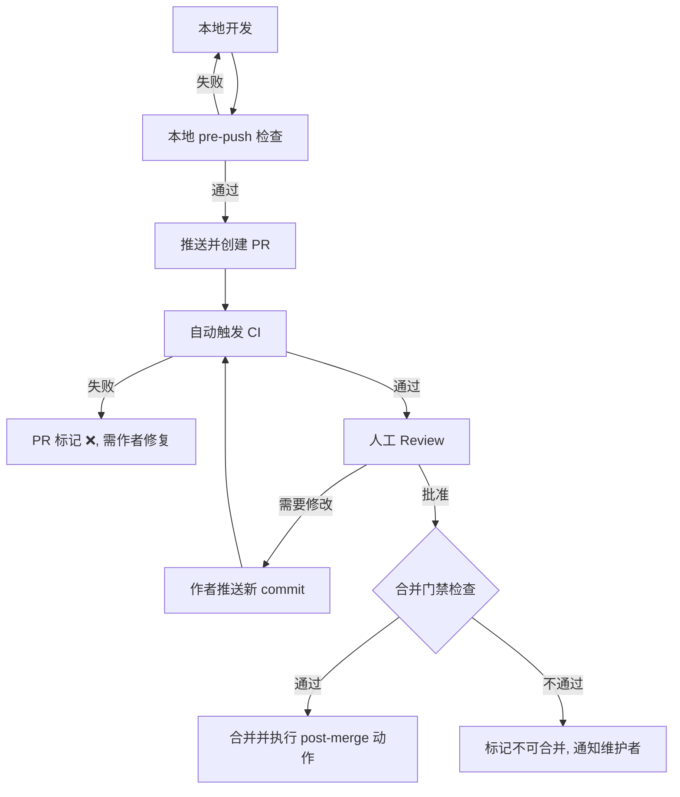

以下是一个**基于 Pull Request 的代码提交流程设计方案**，适用于团队协作开发，兼顾代码质量、审查效率与发布稳定性。该方案在传统 PR 流程基础上做了若干改进，例如强制前置检查、分支策略精细化、合并门禁等。

---

## 1. 设计目标

- **质量左移**：在 PR 创建前完成大部分自动化验证
- **快速反馈**：PR 审核周期 ≤ 4 小时（视复杂度可调整）
- **可追溯**：每次合并自动关联 Issue / Feature 标识
- **避免混乱**：主分支始终保持可发布状态

---

## 2. 分支模型

| 分支类型      | 命名规则                     | 生命周期                           |
| ------------- | ---------------------------- | ---------------------------------- |
| `main`        | 固定                         | 永久，仅接受 PR 合并，不可直接 push |
| `develop`     | 固定（可选）                 | 永久，用于集成测试（如不使用 `main` 作为集成分支） |
| `feature/*`   | `feature/JIRA-123-short-desc` | 功能开发完成后合并并删除            |
| `hotfix/*`    | `hotfix/v1.2.3-critical-fix`  | 紧急修复，直接基于 `main`           |
| `release/*`   | `release/v1.2.4`             | 发布前冻结，仅允许 bug 修复         |

> **推荐**：小型团队可直接使用 `main` + `feature/*` + `hotfix/*`，省去 `develop`。

---

## 3. 提交流程（分步骤）

### 3.1 本地准备

1. **拉取最新主分支**  
   ```bash
   git checkout main
   git pull --rebase upstream main
   ```

2. **创建特性分支**  
   ```bash
   git checkout -b feature/ABC-123-add-login
   ```

3. **开发与提交**  
   - 每个 commit 应保持原子性（一个逻辑变更）  
   - Commit message 遵循 [Conventional Commits](https://www.conventionalcommits.org/)  
     ```
     feat(auth): add OAuth2 login endpoint
     Closes ABC-123
     ```

### 3.2 推送前检查（Local Hooks / CI）

- **自动执行**（通过 `pre-push` 或 `lefthook`）：  
  - 单元测试（仅增量）  
  - Linter & Formatter  
  - 类型检查（TypeScript / mypy 等）  
  - 私有密钥/日志语句检测（防止硬编码）

- **若检查失败** → 无法推送，强制修复。

### 3.3 推送并创建 PR

```bash
git push -u origin feature/ABC-123-add-login
```

- 使用 PR 模板（减少描述遗漏）  
  模板包含：
  - **关联 Issue**：`Closes #123`  
  - **变更类型**：`feat | fix | docs | style | refactor | test | chore`  
  - **测试情况**：单元测试/手工测试  
  - **影响面**：是否破坏兼容性  
  - **截图/日志**（若适用）

- 为 PR 添加 **标签**（WIP / ready / needs-review / do-not-merge）

### 3.4 自动化流水线（CI）

在 PR 创建时触发以下检查（必须全部通过才能 review）：

| 检查项                     | 超时时间 | 是否阻断 |
| -------------------------- | -------- | -------- |
| 代码格式与 lint            | 5 min    | 是       |
| 单元测试 (全量)            | 15 min   | 是       |
| 集成测试 (关键路径)        | 30 min   | 是（可选）|
| 构建验证（编译/打包）      | 10 min   | 是       |
| 覆盖率检查（不低于阈值 80%）| 5 min    | 是（警告不阻断）|
| 依赖漏洞扫描               | 3 min    | 是       |

- **失败处理**：状态改为 `❌ Checks failed`，禁止合并，除非强制管理员覆盖（审计日志记录）。

### 3.5 人工代码审查

#### 审查者分配
- **自动路由**：根据 CODEOWNERS 或最近活跃贡献者  
- **最少审查人数**：  
  - `feature/*`：至少 1 名 Reviewer（非作者）  
  - `hotfix/*`：至少 1 名 Reviewer + 1 名 Maintainer  
  - `release/*`：至少 2 名 Maintainer

#### 审查要点
- 设计合理性、边界条件、错误处理  
- 性能影响、安全漏洞（SQL 注入、XSS 等）  
- 测试覆盖是否足够  
- 文档是否同步更新

#### 评论与修改
- Review 意见使用 `suggestion` / `question` / `blocking` 标签  
- `blocking` 评论必须解决后 PR 才能合入  
- 作者提交修改后，自动重新触发 CI 并请求 review 更新

### 3.6 合并策略选择

根据团队习惯选择或组合：

| 策略              | 适用场景                         | 优点                       | 缺点                         |
| ----------------- | -------------------------------- | -------------------------- | ---------------------------- |
| **Squash and merge** | 特性分支含有多个临时 commit       | 历史线性干净，易回滚       | 丢失中间 commit 上下文       |
| **Rebase and merge** | 每个 commit 都有独立意义          | 保持提交历史整洁且可追溯   | 可能破坏依赖工作流           |
| **Merge commit**    | 保留完整分支拓扑（如 release）    | 分组清晰，便于 revert 整个 PR | 历史图杂乱                   |

> **推荐默认**：`Squash and merge` + PR 标题作为最终 commit message（自动填充关联 Issue）

### 3.7 合并前最终门禁

在点击 Merge 按钮前必须满足：

- ✅ CI 全部通过（绿色）  
- ✅ 获得所需数量的批准（`approved`）  
- ✅ 无 `blocking` 未解决评论  
- ✅ 分支与目标分支无冲突（若有冲突，需本地 rebase 并重新推送）

### 3.8 合并后动作

- 自动删除源分支（避免分支堆积）  
- 触发集成测试流水线（部署到 staging 环境）  
- 若 PR 标题/描述包含 `Closes #xxx`，自动关闭 Issue  
- 发送合并通知到团队 IM 频道（含 PR 链接、作者、摘要）

---

## 4. 特殊流程变体

### 4.1 紧急热修复（Hotfix）

1. 从 `main` 切出 `hotfix/*`  
2. 跳过部分非关键 CI（如集成测试可选），但必须包含安全扫描  
3. 允许 1 人快速 Review（事后需补一位 Reviewer）  
4. 合并后立即触发生产发布流水线

### 4.2 大功能（需要集成多人的 PR）

- 使用 **Stacked PR** 模式（基于依赖链，如 `feature/base` → `feature/child`）  
- 工具支持：`gh pr create --stack` 或 `Graphite`  
- 合并时确保底层 PR 先合入，避免破坏依赖

### 4.3 长期维护分支（如 `release/v1`）

- PR 需同时合并到 `main` 和 `release/v1`（使用 `git cherry-pick` 或双 PR）  
- CI 需针对两个目标分支分别运行

---

## 5. 角色与职责

| 角色         | 职责                                                         |
| ------------ | ------------------------------------------------------------ |
| **贡献者**   | 创建高质量 PR，及时响应 review，确保本地检查通过              |
| **审查者**   | 24 小时内完成首轮 review，使用精确评论标签，关注设计而非 nitpick |
| **维护者**   | 监控积压 PR，主持合并会议（必要时），处理合并冲突与门禁豁免   |
| **CI 管理员**| 维护流水线稳定，更新检查规则                                 |

---

## 6. 度量与改进

收集以下指标，每迭代回顾一次：

- 平均 PR 创建到合并时长  
- 平均首次审查响应时间  
- 因 CI 失败的 PR 比例  
- 每个 PR 的平均评论轮数  

**持续改进**：
- 评论轮数 > 3 → 增加设计预审环节  
- CI 失败率 > 20% → 加强本地 pre-push 检查  
- 审查响应时间 > 8h → 扩大审查者池或设定值班表

---

## 7. 工具推荐

- **代码托管**：GitHub / GitLab (内置 PR/MR)  
- **CI/CD**：GitHub Actions / GitLab CI / Buildkite  
- **本地检查**：`pre-commit` + `husky` + `lefthook`  
- **审查辅助**：`CodeSuggest` (AI 预审), `Sider` (自动化 Lint)  
- **分支管理**：`gitstream` / `mergequeue` (自动排队合并)

---

## 8. 流程图（Mermaid）



---

此流程可根据团队规模（2–50人）和项目紧急度灵活裁剪，核心原则是 **自动化 + 轻量审查 + 快速闭环**。